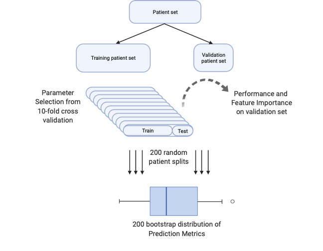

Monte Carlo Cross Validation
================

# Work In Progress!

# Generate robust prediction intervals with the *mccv* python package

Binary and Multi-classification algorithm implemented by Giangreco et
al. (see references)



# Objectives of this project

1.  *mccv* python package: easily implement and perform MCCV for
    learning and prediction tasks.
2.  Ingest and return dataframes to accessibly build, validate, and
    interpret MCCV classifiers.
3.  Show usage in both python and R for even more community
    accessibility.

# Installation

    mkdir ~/my_directory #choose where to clone the mccv repository
    cd ~/my_directory
    git clone https://github.com/ngiangre/mccv.git
    cd mccv/
    python3 -m pip install .

# Usage

# Python

``` python
import pandas as pd
data = pd.read_csv('data/data.csv',index_col=0) # Feature column name is 'biomarker' and response column  name is 'status'
```

``` python
data.describe()
```

               status   biomarker
    count  100.000000  100.000000
    mean     0.500000    0.095906
    std      0.502519    1.127545
    min      0.000000   -2.163797
    25%      0.000000   -0.621123
    50%      0.500000    0.199851
    75%      1.000000    0.837820
    max      1.000000    2.338124

``` python
data.groupby('status').describe()
```

           biomarker                      ...                              
               count      mean       std  ...       50%       75%       max
    status                                ...                              
    0           50.0 -0.020558  1.130326  ...  0.081415  0.815223  2.202075
    1           50.0  0.212370  1.123985  ...  0.360705  0.833713  2.338124

    [2 rows x 8 columns]

``` python
import mccv
mccv_obj = mccv.mccv(num_bootstraps=200)
mccv_obj.set_X( data.loc[:,['biomarker']] )
mccv_obj.set_Y( data.loc[:,['status']] )
mccv_obj.run_mccv()
mccv_obj.run_permuted_mccv()

#Output
#mccv_obj.mccv_data # 4 element dictionary
#mccv_obj.mccv_permuted_data # 4 element dictionary
```

# R

``` r
#install.packages("tidyverse")
library(tidyverse)
```

    ── Attaching packages ─────────────────────────────────────── tidyverse 1.3.2 ──
    ✔ ggplot2 3.4.0      ✔ purrr   0.3.5 
    ✔ tibble  3.1.8      ✔ dplyr   1.0.10
    ✔ tidyr   1.2.1      ✔ stringr 1.5.0 
    ✔ readr   2.1.3      ✔ forcats 0.5.2 
    ── Conflicts ────────────────────────────────────────── tidyverse_conflicts() ──
    ✖ dplyr::filter() masks stats::filter()
    ✖ dplyr::lag()    masks stats::lag()

``` r
data <- read_csv("data/data.csv",col_types = c("iid"))
data
```

    # A tibble: 100 × 3
         obs status biomarker
       <int>  <int>     <dbl>
     1     1      0     1.67 
     2     2      0    -0.876
     3     3      0    -1.39 
     4     4      0    -0.297
     5     5      1     0.190
     6     6      0     2.20 
     7     7      1    -0.121
     8     8      1     0.896
     9     9      1     0.153
    10    10      1     0.259
    # … with 90 more rows

``` r
summary(data)
```

          obs             status      biomarker       
     Min.   :  1.00   Min.   :0.0   Min.   :-2.16380  
     1st Qu.: 25.75   1st Qu.:0.0   1st Qu.:-0.62112  
     Median : 50.50   Median :0.5   Median : 0.19985  
     Mean   : 50.50   Mean   :0.5   Mean   : 0.09591  
     3rd Qu.: 75.25   3rd Qu.:1.0   3rd Qu.: 0.83782  
     Max.   :100.00   Max.   :1.0   Max.   : 2.33812  

``` r
summary(data$biomarker[data$status==0])
```

        Min.  1st Qu.   Median     Mean  3rd Qu.     Max. 
    -2.16380 -0.86954  0.08141 -0.02056  0.81522  2.20207 

``` r
summary(data$biomarker[data$status==1])
```

       Min. 1st Qu.  Median    Mean 3rd Qu.    Max. 
    -2.1309 -0.3479  0.3607  0.2124  0.8337  2.3381 

``` r
mccv = reticulate::import('mccv')
mccv_obj = mccv$mccv(num_bootstraps = as.integer(200))
mccv_obj$set_X(data[,c('biomarker')])
mccv_obj$set_Y(data[,c('status')])
mccv_obj$run_mccv()
mccv_obj$run_permuted_mccv()
lapply(mccv_obj$mccv_data,tibble)
```

    Warning in py_to_r.pandas.core.frame.DataFrame(object): index contains
    duplicated values: row names not set

    Warning in py_to_r.pandas.core.frame.DataFrame(object): index contains
    duplicated values: row names not set

    $`Model Learning`
    # A tibble: 200 × 5
       bootstrap model               test_roc_auc train_roc_auc validation_roc_auc
           <dbl> <chr>                      <dbl>         <dbl>              <dbl>
     1         0 Logistic Regression        1             0.529              0.611
     2         1 Logistic Regression        0.8           0.515              0.732
     3         2 Logistic Regression        1             0.543              0.4  
     4         3 Logistic Regression        0.875         0.520              0.727
     5         4 Logistic Regression        0.812         0.554              0.574
     6         5 Logistic Regression        1             0.550              0.536
     7         6 Logistic Regression        0.688         0.578              0.5  
     8         7 Logistic Regression        0.9           0.603              0.268
     9         8 Logistic Regression        0.812         0.555              0.554
    10         9 Logistic Regression        0.85          0.515              0.571
    # … with 190 more rows

    $`Feature Importance`
    # A tibble: 400 × 4
       bootstrap feature   importance model              
           <dbl> <chr>          <dbl> <chr>              
     1         0 biomarker      1.01  Logistic Regression
     2         0 Intercept     -0.600 Logistic Regression
     3         1 biomarker      0.509 Logistic Regression
     4         1 Intercept     -0.226 Logistic Regression
     5         2 biomarker      1.59  Logistic Regression
     6         2 Intercept     -0.938 Logistic Regression
     7         3 biomarker      0.826 Logistic Regression
     8         3 Intercept     -0.592 Logistic Regression
     9         4 biomarker      0.866 Logistic Regression
    10         4 Intercept     -0.533 Logistic Regression
    # … with 390 more rows

    $`Patient Predictions`
    # A tibble: 3,000 × 5
       bootstrap model               y_pred y_proba y_true
           <dbl> <chr>                <int>   <dbl>  <int>
     1         0 Logistic Regression      0   0.384      1
     2         0 Logistic Regression      1   0.601      0
     3         0 Logistic Regression      0   0.401      0
     4         0 Logistic Regression      1   0.512      1
     5         0 Logistic Regression      0   0.393      0
     6         0 Logistic Regression      0   0.466      1
     7         0 Logistic Regression      1   0.536      1
     8         0 Logistic Regression      0   0.354      0
     9         0 Logistic Regression      0   0.447      0
    10         0 Logistic Regression      0   0.398      1
    # … with 2,990 more rows

    $Performance
    # A tibble: 50 × 4
       model               metric  performance_bootstrap value
       <chr>               <chr>                   <dbl> <dbl>
     1 Logistic Regression roc_auc                     0 0.468
     2 Logistic Regression roc_auc                     1 0.468
     3 Logistic Regression roc_auc                     2 0.481
     4 Logistic Regression roc_auc                     3 0.482
     5 Logistic Regression roc_auc                     4 0.476
     6 Logistic Regression roc_auc                     5 0.470
     7 Logistic Regression roc_auc                     6 0.471
     8 Logistic Regression roc_auc                     7 0.460
     9 Logistic Regression roc_auc                     8 0.467
    10 Logistic Regression roc_auc                     9 0.465
    # … with 40 more rows

# Contribute

Please do! Reach out to Nick directly (nick.giangreco@gmail.com), make
an issue, or make a pull request.

# License

This software is released under the MIT license, which can be found in
LICENSE in the root directory of this repository.

# Citation

Giangreco, N.P., Lebreton, G., Restaino, S. et al. Alterations in the
kallikrein-kinin system predict death after heart transplant. Sci Rep
12, 14167 (2022). <https://doi.org/10.1038/s41598-022-18573-2>

Giangreco et al. 2021. Plasma kallikrein predicts primary graft
dysfunction after heart transplant. Journal of Heart and Lung
Transplantation, 40(10), 1199-1211.
<https://doi.org/10.1016/j.healun.2021.07.001>.
