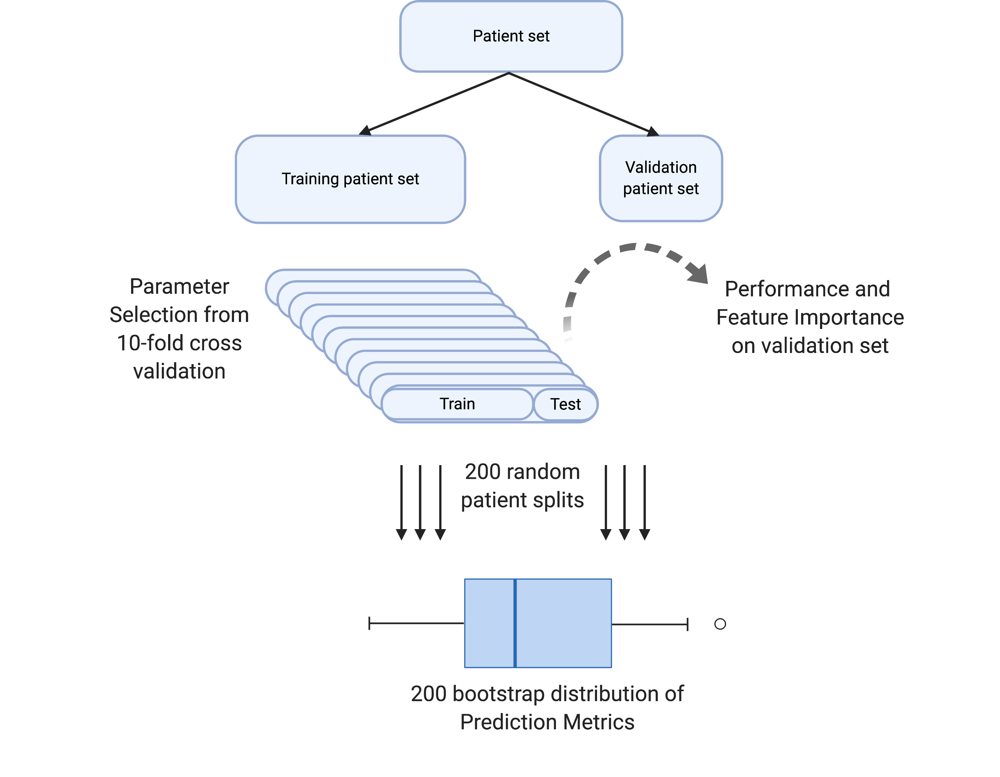

Monte Carlo Cross Validation
================

# Evidentiary and interpretable prediction

Binary and Multi-classification algorithm for adverse outcome detection,
survival classification, and endpoint prediction (see references for
details)



# Objectives of this project

1.  Build the *mccv* python package: easily implement and perform MCCV
    for learning and prediction tasks.
2.  Showcase accessibly to build, validate, and interpret MCCV
    classifiers.
3.  Demonstrate use in both python and R for diverse community
    implementations.

# Installation

    mkdir ~/my_directory #choose where to clone the mccv repository
    cd ~/my_directory
    git clone https://github.com/ngiangre/mccv.git
    cd mccv/
    python3 -m pip install .

# Usage

# Python

``` python
import pandas as pd
data = pd.read_csv('data/data.csv',index_col=0) # Feature column name is 'biomarker' and response column  name is 'status'
data.head()
```

         status  biomarker
    obs                   
    1         0   1.665731
    2         0  -0.875837
    3         0  -1.391374
    4         0  -0.297352
    5         1   0.189857

``` python
import mccv
mccv_obj = mccv.mccv(num_bootstraps=200)
mccv_obj.set_X( data.loc[:,['biomarker']] )
mccv_obj.set_Y( data.loc[:,['status']] )
mccv_obj.run_mccv()
mccv_obj.run_permuted_mccv()

#Output
for n in mccv_obj.mccv_data:
    print(n)
    mccv_obj.mccv_data[n].head()
```

    Model Learning
       bootstrap                model  ...  train_roc_auc  validation_roc_auc
    0          0  Logistic Regression  ...       0.529453            0.611111
    1          1  Logistic Regression  ...       0.515235            0.732143
    2          2  Logistic Regression  ...       0.543056            0.400000
    3          3  Logistic Regression  ...       0.519728            0.727273
    4          4  Logistic Regression  ...       0.554054            0.574074

    [5 rows x 5 columns]
    Feature Importance
       bootstrap    feature  importance                model
    0          0  biomarker    1.009705  Logistic Regression
    1          0  Intercept   -0.598575  Logistic Regression
    0          1  biomarker    0.509433  Logistic Regression
    1          1  Intercept   -0.226550  Logistic Regression
    0          2  biomarker    1.598627  Logistic Regression
    Patient Predictions
         bootstrap                model  y_pred   y_proba  y_true
    obs                                                          
    27           0  Logistic Regression       0  0.384723       1
    87           0  Logistic Regression       1  0.601359       0
    3            0  Logistic Regression       0  0.401320       0
    56           0  Logistic Regression       1  0.512481       1
    76           0  Logistic Regression       0  0.393009       0
    Performance
                     model   metric  performance_bootstrap     value
    0  Logistic Regression  roc_auc                      0  0.467487
    1  Logistic Regression  roc_auc                      1  0.467776
    2  Logistic Regression  roc_auc                      2  0.480176
    3  Logistic Regression  roc_auc                      3  0.480679
    4  Logistic Regression  roc_auc                      4  0.475859

``` python
for n in mccv_obj.mccv_permuted_data:
    print(n)
    mccv_obj.mccv_permuted_data[n].head()
```

    Model Learning
       bootstrap                model  ...  train_roc_auc  validation_roc_auc
    0          0  Logistic Regression  ...       0.506233            0.642857
    1          1  Logistic Regression  ...       0.492030            0.703704
    2          2  Logistic Regression  ...       0.510135            0.537037
    3          3  Logistic Regression  ...       0.506944            0.703704
    4          4  Logistic Regression  ...       0.589547            0.340909

    [5 rows x 5 columns]
    Feature Importance
       bootstrap    feature  importance                model
    0          0  biomarker   -0.196116  Logistic Regression
    1          0  Intercept    0.079220  Logistic Regression
    0          1  biomarker   -0.628093  Logistic Regression
    1          1  Intercept    0.236617  Logistic Regression
    0          2  biomarker    0.166196  Logistic Regression
    Patient Predictions
         bootstrap                model  y_pred   y_proba  y_true
    obs                                                          
    27           0  Logistic Regression       1  0.513536       1
    87           0  Logistic Regression       0  0.470809       0
    3            0  Logistic Regression       1  0.510160       0
    56           0  Logistic Regression       0  0.488317       1
    76           0  Logistic Regression       1  0.511844       1
    Performance
                     model   metric  performance_bootstrap     value
    0  Logistic Regression  roc_auc                      0  0.440616
    1  Logistic Regression  roc_auc                      1  0.442506
    2  Logistic Regression  roc_auc                      2  0.449941
    3  Logistic Regression  roc_auc                      3  0.440162
    4  Logistic Regression  roc_auc                      4  0.449896

# R

``` r
if(!requireNamespace("readr")){install.packages("readr")}
```

    Loading required namespace: readr

``` r
library(readr)
data <- read_csv("data/data.csv",col_types = c("iid")) #set obs as integer, status as integer, and biomarker as double
head(data)
```

    # A tibble: 6 × 3
        obs status biomarker
      <int>  <int>     <dbl>
    1     1      0     1.67 
    2     2      0    -0.876
    3     3      0    -1.39 
    4     4      0    -0.297
    5     5      1     0.190
    6     6      0     2.20 

``` r
if(!requireNamespace("reticulate")){install.packages("reticulate")}
mccv = reticulate::import('mccv')
mccv_obj = mccv$mccv(num_bootstraps = as.integer(200))

X = reticulate::r_to_py(data[,c('obs','biomarker')])
X = X$set_index(reticulate::r_to_py('obs'))

y = reticulate::r_to_py(data[,c('obs','status')])
y = y$set_index(reticulate::r_to_py('obs'))

mccv_obj$set_X(X)
mccv_obj$set_Y(y)
mccv_obj$run_mccv()
mccv_obj$run_permuted_mccv()

#Output
lapply(mccv_obj$mccv_data,head)
```

    Warning in py_to_r.pandas.core.frame.DataFrame(object): index contains
    duplicated values: row names not set

    Warning in py_to_r.pandas.core.frame.DataFrame(object): index contains
    duplicated values: row names not set

    $`Model Learning`
      bootstrap               model test_roc_auc train_roc_auc validation_roc_auc
    1         0 Logistic Regression       1.0000     0.5294525          0.6111111
    2         1 Logistic Regression       0.8000     0.5152355          0.7321429
    3         2 Logistic Regression       1.0000     0.5430556          0.4000000
    4         3 Logistic Regression       0.8750     0.5197279          0.7272727
    5         4 Logistic Regression       0.8125     0.5540541          0.5740741
    6         5 Logistic Regression       1.0000     0.5499325          0.5357143

    $`Feature Importance`
      bootstrap   feature importance               model
    1         0 biomarker  1.0097049 Logistic Regression
    2         0 Intercept -0.5985751 Logistic Regression
    3         1 biomarker  0.5094328 Logistic Regression
    4         1 Intercept -0.2265503 Logistic Regression
    5         2 biomarker  1.5986271 Logistic Regression
    6         2 Intercept -0.9420031 Logistic Regression

    $`Patient Predictions`
      bootstrap               model y_pred   y_proba y_true
    1         0 Logistic Regression      0 0.3847230      1
    2         0 Logistic Regression      1 0.6013587      0
    3         0 Logistic Regression      0 0.4013202      0
    4         0 Logistic Regression      1 0.5124811      1
    5         0 Logistic Regression      0 0.3930090      0
    6         0 Logistic Regression      0 0.4660667      1

    $Performance
                    model  metric performance_bootstrap     value
    1 Logistic Regression roc_auc                     0 0.4674874
    2 Logistic Regression roc_auc                     1 0.4677764
    3 Logistic Regression roc_auc                     2 0.4801763
    4 Logistic Regression roc_auc                     3 0.4806793
    5 Logistic Regression roc_auc                     4 0.4758592
    6 Logistic Regression roc_auc                     5 0.4687351

``` r
lapply(mccv_obj$mccv_permuted_data,head)
```

    Warning in py_to_r.pandas.core.frame.DataFrame(object): index contains
    duplicated values: row names not set

    Warning in py_to_r.pandas.core.frame.DataFrame(object): index contains
    duplicated values: row names not set

    $`Model Learning`
      bootstrap               model test_roc_auc train_roc_auc validation_roc_auc
    1         0 Logistic Regression       0.5500     0.5062327          0.6428571
    2         1 Logistic Regression       0.8000     0.4920305          0.7037037
    3         2 Logistic Regression       0.5625     0.5101351          0.5370370
    4         3 Logistic Regression       0.8000     0.5069444          0.7037037
    5         4 Logistic Regression       0.9000     0.5895470          0.3409091
    6         5 Logistic Regression       0.7000     0.5360111          0.5178571

    $`Feature Importance`
      bootstrap   feature  importance               model
    1         0 biomarker -0.19611610 Logistic Regression
    2         0 Intercept  0.07921951 Logistic Regression
    3         1 biomarker -0.62809256 Logistic Regression
    4         1 Intercept  0.23661698 Logistic Regression
    5         2 biomarker  0.16619555 Logistic Regression
    6         2 Intercept -0.01455491 Logistic Regression

    $`Patient Predictions`
      bootstrap               model y_pred   y_proba y_true
    1         0 Logistic Regression      1 0.5135363      1
    2         0 Logistic Regression      0 0.4708091      0
    3         0 Logistic Regression      1 0.5101595      0
    4         0 Logistic Regression      0 0.4883168      1
    5         0 Logistic Regression      1 0.5118443      1
    6         0 Logistic Regression      0 0.4973405      1

    $Performance
                    model  metric performance_bootstrap     value
    1 Logistic Regression roc_auc                     0 0.4406164
    2 Logistic Regression roc_auc                     1 0.4425061
    3 Logistic Regression roc_auc                     2 0.4499406
    4 Logistic Regression roc_auc                     3 0.4401616
    5 Logistic Regression roc_auc                     4 0.4498963
    6 Logistic Regression roc_auc                     5 0.4436607

# Contribute

Please do! Reach out to Nick directly (nick.giangreco@gmail.com), make
an issue, or make a pull request.

# License

This software is released under the MIT license, which can be found in
LICENSE in the root directory of this repository.

# Citation

Giangreco, N.P., Lebreton, G., Restaino, S. et al. Alterations in the
kallikrein-kinin system predict death after heart transplant. Sci Rep
12, 14167 (2022). <https://doi.org/10.1038/s41598-022-18573-2>

Giangreco et al. 2021. Plasma kallikrein predicts primary graft
dysfunction after heart transplant. Journal of Heart and Lung
Transplantation, 40(10), 1199-1211.
<https://doi.org/10.1016/j.healun.2021.07.001>.
